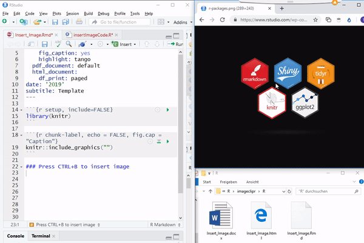
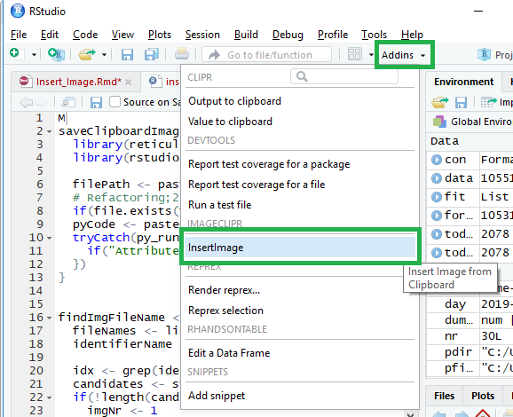
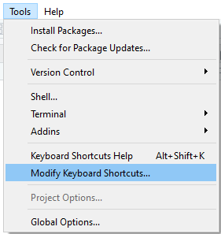
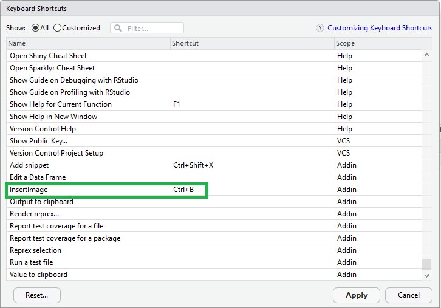

## imageclipr
[](https://cran.r-project.org/package=imageclipr)

RStudio Addin: Copy images from clipboard into RMarkdown .Rmd files.



## Installation
`devtools::install_github('Timag/imageclipr')`

## Dependencies
R packages `library(rstudioapi)`,  (`library(rmarkdown)` for markdown files)

For linux [xclip](https://github.com/astrand/xclip) is required.
For debian, ubuntu,... install it with:
```
sudo apt-get install xclip 
```

## Open issues
- can not: 

-- copy and paste image and text together

-- copy and paste an image by copying the file in the explorer

## Technical walkthrough
(highlevel): https://stackoverflow.com/questions/55541345/copy-and-paste-an-image-from-clipboard-to-rmarkdown-rmd-code


## Usage

### Select the addin

Note: You will see "Paste Img to Rmd file" instead of "Insert Image".



### Adding a keyboard shortcut (Recommended)
In RStudio go to Tools - Modify Keyboard Shortcuts...

Note: You will see "Paste Img to Rmd file" instead of "Insert Image".







(This project is part of my life long application to RStudio :))
